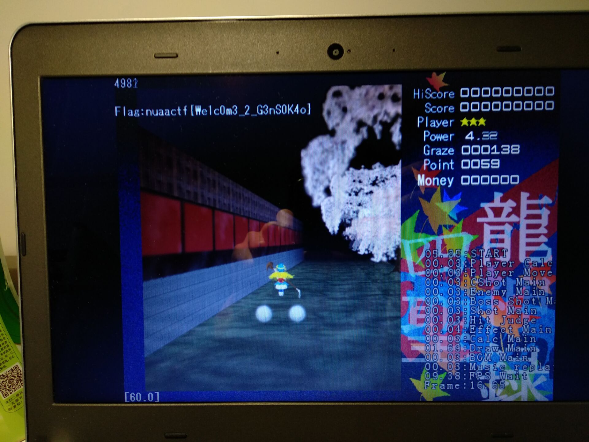

# STG TouHou
是一个彻头彻尾的车万游戏呢。

## 做法

### 正常通关
通关游戏，会把flag打印在屏幕上


### 逆向分析
这个题目会告知大家这个程序叫做四圣龙神录，其实是可以从github上找到源码的。Rev的题目拿到了源码，那基本上就做出来了。当然源代码肯定没有flag相关的逻辑，可以结合源代码对程序进行审计。
首先逆向日常搜索flag字符串，会发现如下的函数:
```C
void sub_4308D0()
{
  int v0; // eax

  if ( dword_D0CA74 == 1 )
  {
    v0 = sub_40E039(255, 255, 255);
    sub_40D837(0, 40, v0, "Flag:%s", (unsigned int)&byte_D0CA78);
  }
}
```
这个Flag很显然是刻意打印的，那么追踪一下这个byte_D0CA78
```C
signed int __cdecl sub_430730(char a1)
{
  signed int result; // eax
  char v2; // STD7_1
  signed int i; // [esp+E8h] [ebp-8h]
  signed int j; // [esp+E8h] [ebp-8h]

  for ( i = 0; i < 54; ++i )
    byte_AEE308[i] -= a1;
  for ( j = 0; ; j += 2 )
  {
    result = j;
    if ( j >= 54 )
      break;
    v2 = 16 * trans2num(byte_AEE308[j]);
    byte_D0CA78[j / 2] = trans2num(byte_AEE309[j]) + v2;
  }
  dword_D0CA74 = 1;
  return result;
}
```
会找到这个函数，可以看到这里又存储了一个全局变量。这里的运算相当于是将一个数字分成了高4bit和低4bit然后进行合并处理，那么我们继续回溯，检查这个`byte_AEE308`的来历，会找到另一段的程序逻辑:
```C
signed int __cdecl sub_430850(char a1)
{
  signed int result; // eax
  signed int i; // [esp+DCh] [ebp-8h]

  for ( i = 0; ; ++i )
  {
    result = i;
    if ( i >= 54 )
      break;
    byte_AEE308[i] ^= a1;
  }
  return result;
}
```
跟踪调用关系，会发现这两个函数是由同一个函数调用的:
```C
signed int __cdecl sub_430960(int a1, char a2)
{
  signed int result; // eax

  if ( a1 == 1 )
    return sub_405696(a2);
  if ( a1 == 2 )
    result = sub_402A09(a2);
  return result;
}

```
跟踪到外面，可以看到这样的逻辑
```C
       result = dword_D0C03C++ + 1;
        if ( dword_D0C03C == 1 )
          return sub_40A907(dword_D0C03C, 255);
        if ( dword_D0C03C == 2 )
          result = sub_40A907(dword_D0C03C, 19);
        return result;
```
结合东方（游戏逻辑！）一般来说都是先1后2，所以是先调用前面那个逻辑后调用后面的逻辑。于是根据调用顺序，我们能够写出解密脚本:
```python
import codecs
enc = [182,135,181,183,182,187,182,187,182,185,181,184,182,182,181,138,183,181,182,183,185,187,182,185,185,188,182,136,185,185,183,134,185,186,183,134,184,181,185,185,182,135,183,185,185,188,184,138,185,184,182,134,181,136 ]

def dec_one(enc, num):
    for i in range(len(enc)):
        enc[i] ^= num

def dec_two(enc, num):
    for i in range(len(enc)):
        enc[i] -= num

    tmp = 0
    ans = ''.join(chr(c) for c in enc)
    print(codecs.decode(ans,'hex'))


if __name__ == '__main__':
    dec_one(enc, 255)
    dec_two(enc, 19)
    # nuaactf{We1c0m3_2_G3nS0K4o}
```