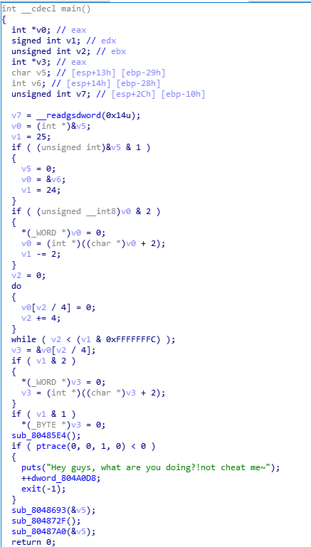
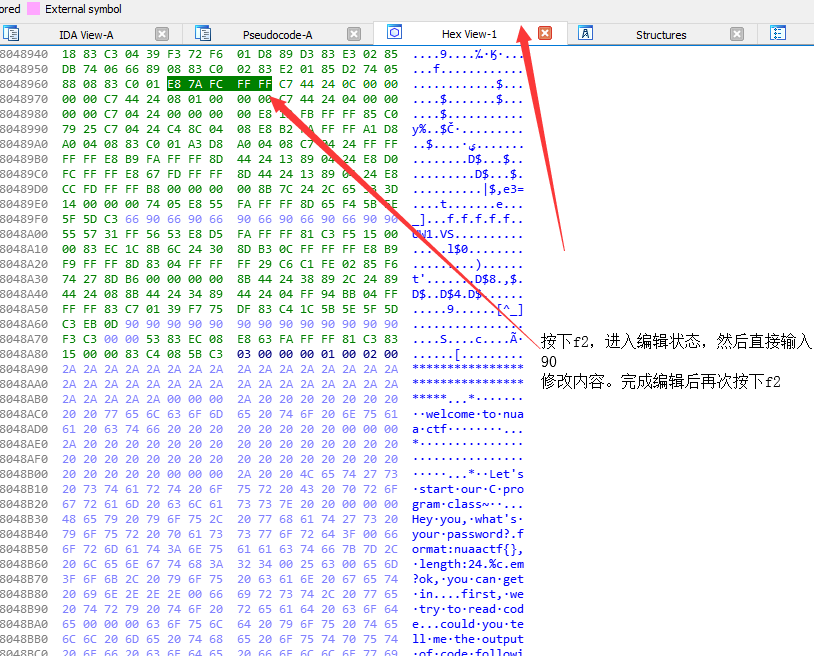
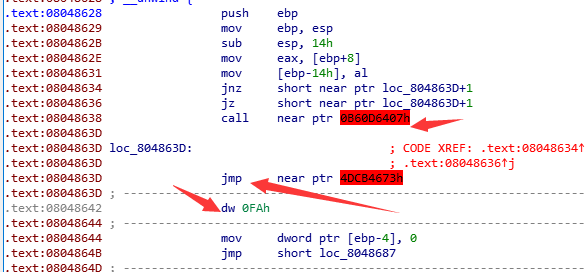
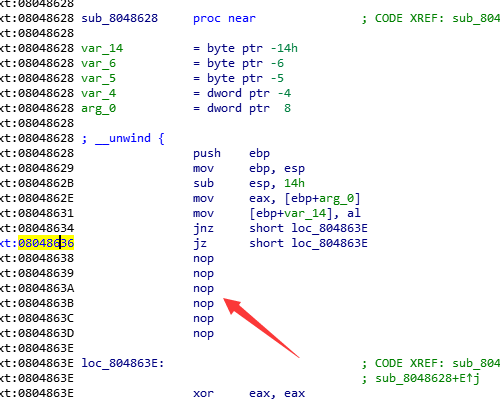

## Middle
题目来源：因为难度定位是中等所以叫这个

### 初步准备
对于想要做这个题目的人来说，想必也是有了一定的基础。比如说首先要认得这个程序是一个ELF文件是Linux下的可执行文件之类的。（其实我第一次做的时候就不会认这个，滑稽）
那么逆向首先无非准备几个工具

 * 静态工具：IDA
 * 动态分析工具：gdb
 * 环境：Ubuntu

首先运行程序，发现程序两个行为：

 * 输入`nuaactf{.+}`格式的字符串
 * 如果输入完成，会让我们做一个C语言的题目

而且在运行的时候会发现，程序会在5秒之内结束。整个题目第一眼逻辑就有了

### 静态辅助
然后掏出静态分析工具，这里使用IDA做例子:

分析逻辑，前面一大段其实是字符串在计算对齐的内容，不是特别重要。整体分析就会发现其实是一个给字符串置0的操作。之后的第一个函数`sub_80485E4();`在打印欢迎内容，之后会遇到函数:
```C
  if ( ptrace(0, 0, 1, 0) < 0 )
  {
    puts("Hey guys, what are you doing?!not cheat me~");
    ++dword_804A0D8;
    exit(-1);
  }
```
这个`ptrace`上网查就会发现，这个函数会阻止动态调试，这里可以选择将这个内容patch掉，将二进制内容改成90（nop），跳过这个内容。

或者gdb调试直接跳过这个内容也可以，反正有办法都行。

之后来到这个地方的逻辑:
```C
  puts("Hey you, what's your password?");
  puts("format:nuaactf{}, length:24");
  for ( i = 0; i < 24; ++i )
    __isoc99_scanf("%c", i + a1);
  puts("em?ok, you can get in...");
  for ( j = 0; ; ++j )
  {
    result = j;
    if ( j >= 24 )
      break;
    *(_BYTE *)(j + a1) = ((int (__cdecl *)(_DWORD))loc_8048628)(*(unsigned __int8 *)(j + a1));
  }
```
可以看到这里的内容就是让我们输入一段类似flag的内容，不过注意到，最后会对数组`a1`的每一个元素进行更新，但是似乎是一个没有被识别成函数的内容，跟进去查看:

发现一些奇怪的指令阻止了程序的正常解析，不过仔细观察，似乎这个跳转根本就不会调用到这些神奇的指令，利用前面教过的patch方法，就能够修改掉程序内容，看到正确的程序内容:

```C
  v2 = 0;
  for ( i = 0; i <= 7; ++i )
    v2 |= (((signed int)a1 >> i) & 1) << *(_BYTE *)(i + 0x804A0C2);
  return v2
```
这个巨大的数字其实是一个地址，里面内容为
```
.data:0804A0C2                 db    3
.data:0804A0C3                 db    7
.data:0804A0C4                 db    2
.data:0804A0C5                 db    1
.data:0804A0C6                 db    6
.data:0804A0C7                 db    4
.data:0804A0C8                 db    5
.data:0804A0C9                 db    0
```
理解一下，就相当于是一个数组的下标i在遍历。总的分析这个算法，其实就是**将一个字节的每一bit的顺序重新映射到一个新的位置上**具体对应关系为:
```
0 1 2 3 4 5 6 7
3 7 2 1 6 4 5 0
```

### C语言课程
然后有一个让大家轻松一下的环节，让大家输入一个程序的运行结果。这个一看就是宏定义的错误实例，即会产生一个非预期的答案
```
1+3*1+4 = 8
```
不过其实整个考出来跑也是可以的~

### 最后的答案
最后一段逻辑如下
```C
  v3 = -66;
  v4 = 116;
  v5 = 48;
  v6 = 48;
  v7 = -80;
  v8 = 124;
  v9 = -68;
  v10 = -14;
  v11 = 42;
  v12 = 48;
  v13 = 48;
  v14 = 16;
  v15 = 98;
  v16 = -74;
  v17 = 116;
  v18 = -26;
  v19 = -92;
  v20 = 88;
  v21 = 124;
  v22 = -26;
  v23 = 80;
  v24 = 124;
  v25 = 16;
  v26 = 118;
  puts("Well,Well,You get here right?");
  if ( !dword_804A0D8 || dword_804A0D0 )
  {
    puts("En?No No No you are not clever~");
  }
  else
  {
    puts("!!! Hey !!!");
    puts("Do you remember your password?");
    for ( i = 0; i <= 23; ++i )
    {
      *(_BYTE *)(a1 + i) = *(_BYTE *)(i + a1) ^ dword_804A0D4;
      if ( *(&v3 + i) != *(_BYTE *)(i + a1) )
        break;
    }
    if ( i == 24 )
      puts("YOU ARE RIGHT!THE KEY IS FLAG!");
    else
      puts("O?Nearly");
  }
```
可以看到离正确答案很近了~
不过会发现，不是那么容易能够进入这个匹配逻辑。仔细观察会发现，变量`dword_804A0D8`在一开始的`ptrace`处出现过，而`dword_804A0D0`则是会在一个handler里面出现，这个handler其实是注册的一个信号事件，5秒后自动跳转为1（这个地方其实是坑调试器用的，因为调试器可以选择忽略alarm但是此时变量依然会被置为1）不过一样可以用强硬的手段跳过这段逻辑。之后发现是一段关键逻辑比较

```C
      *(_BYTE *)(a1 + i) = *(_BYTE *)(i + a1) ^ dword_804A0D4;
      if ( *(&v3 + i) != *(_BYTE *)(i + a1) )
        break;
```
其中`dword_804A0D4`存放了C语言那段中，我们输入的正确答案。如果输入正确答案，则会通过与上面出现那一大段数字（其实是一个数组）进行异或，得到答案。于是总结下来，我们可以得到整体逻辑:

 * 首先对输入进行bit变化
 * 与C语言输入的正确答案进行异或
 * 与程序内部的数据比较

因此可以写出解密逻辑:
```python
#   -*- coding:utf-8    -*-

bit_map = [7, 3, 2, 0, 5, 6, 4, 1]
check = [190, 116, 48, 48, 176, 124, 188, 242, 42, 48, 48, 16, 98, 182, 116, 230, 164, 88, 124, 230, 80, 124, 16, 118]
right_answer = 8


def bit_detrans(num):
    tmp_u = 0
    for i in range(8):
        tmp = (num >> i) & 0x1
        tmp_u |= (tmp << bit_map[i])
    return tmp_u


tmp = [each ^ right_answer for each in check]
ans = [chr(bit_detrans(each)) for each in tmp]
print(''.join(ans))  # nuaactf{Haa!You_G0t_1t!}
```